## Database practice


### Description

The purpose of this project is to consolidate knowledge 
of working with databases. This project implements a 
connection to the `Postgres` and `MongoDB` databases using 
`JDBC`. The project was written as part of a homework 
assignment for the `Synergy University` course in the 
`Java developer` profession.

### Stack

<table>
  <tr>
    <td align="center">Java</td>
    <td align="center">Maven</td>
    <td align="center">JDBC</td>
    <td align="center">Docker</td>
    <td align="center">Postgres</td>
  </tr>
  <tr>
    <td align="center"></td>
    <td align="center"></td>
    <td align="center">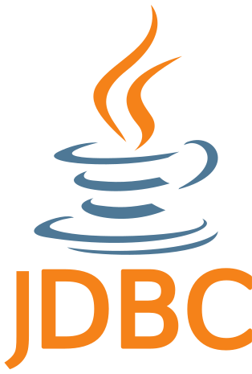</td>
    <td align="center"></td>
    <td align="center"></td>
  </tr>
</table>

<table>
  <tr>
    <td align="center">MongoDB</td>
    <td align="center">ElasticSearch</td>
    <td align="center">Redis</td>
    <td align="center">Kibana</td>
  </tr>
  <tr>
    <td align="center"></td>
    <td align="center"></td>
    <td align="center"></td>
    <td align="center"></td>
  </tr>
</table>

### For checking and testing

<table>
  <tr>
    <td align="center">JUnit</td>
    <td align="center">DBeaver</td>
    <td align="center">MongoDB Compass</td>
    <td align="center">Redis Insight</td>
    <td align="center">Testcontainers</td>
  </tr>
  <tr>
    <td align="center"></td>
    <td align="center"></td>
    <td align="center"></td>
    <td align="center"></td>
    <td align="center"></td>
  </tr>
</table>

### Task 5 in course:

Using the database created in the previous homework (Task 4), 
write a program that outputs to the console:

1) Number of counteragents (organizations)
2) A table of counterparties grouped by type of legal entity,
   columns: type of legal entity, number of legal entities of this type, amount
   of fees paid under contracts
3) A table of all counterparties with data at your discretion,
   for example: name of counterparty, type of counterparty
   (legal entity or individual), country, city, address,
   tax number, email, phone
4) Make sure you use `PreparedStatement` to execute `SQL` queries,
   to avoid `SQL` injections

#### Example:
“Yandex” / Legal entity / Russia / Moscow / Pushkina street,
д. 1 / 1234567890 / ivanov@example.com / +7 (495) 111-11-1

### DB Scheme (Postgres):

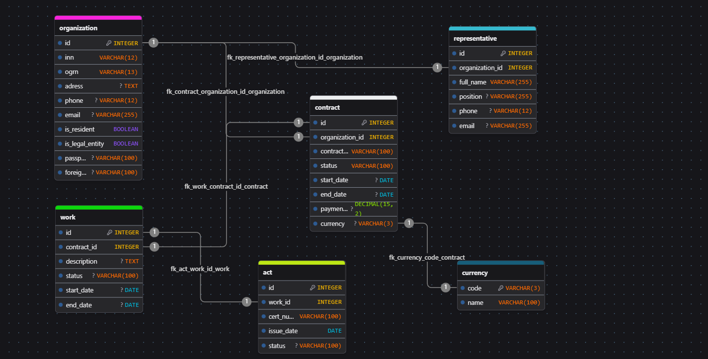

### Result:

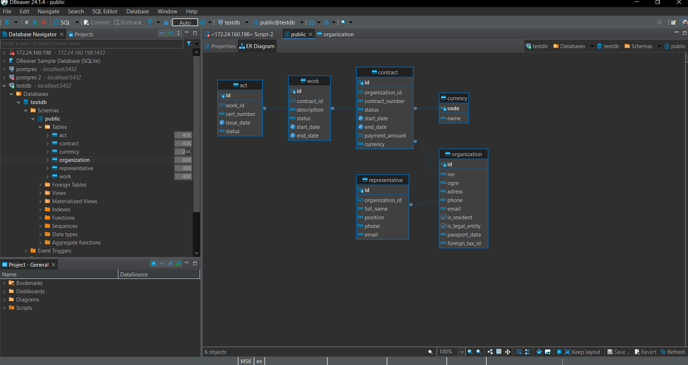


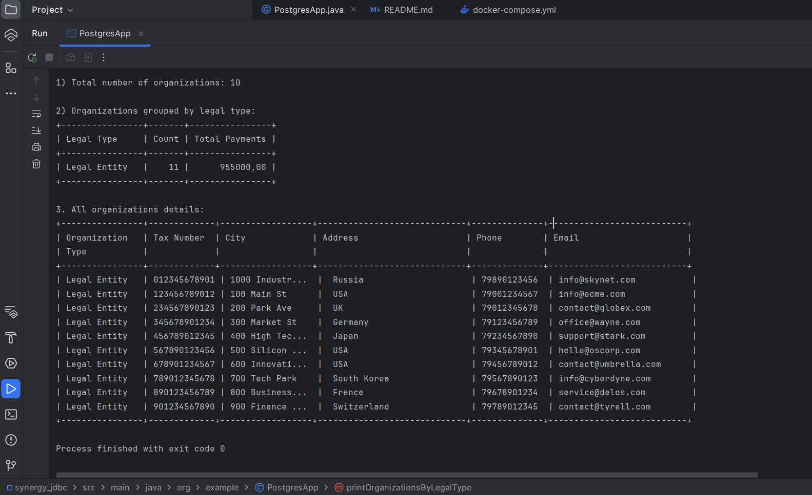

### Task 7 in course:

Also in the project `Mongodb` there is an implementation of connecting to
`MongoDB` and executing queries.
To check, execute the file - `MongoDBApp.java`
For testing was used `MongoDB Compass`, `Redis insight`
and `Kibana`.

#### Command to check :

#### MongoDB Compass:

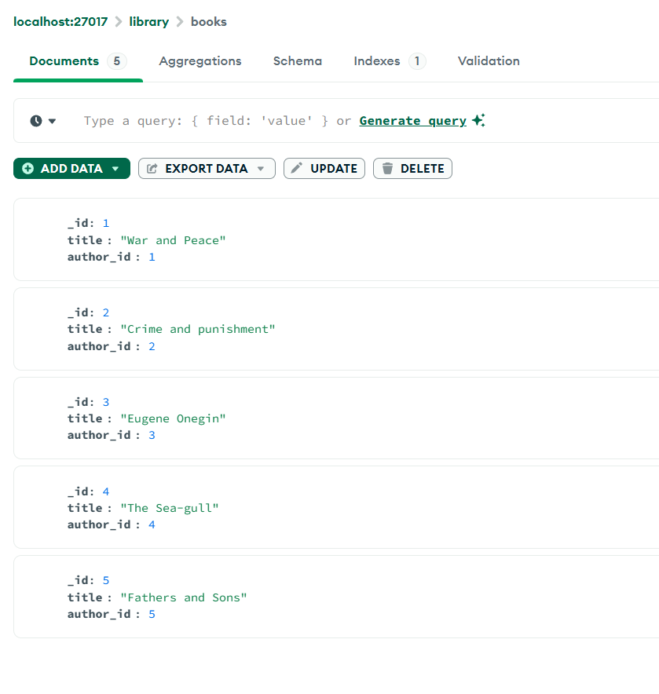

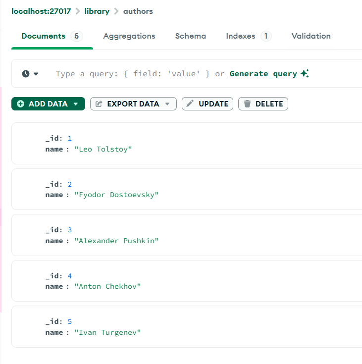

#### Redis Insight:

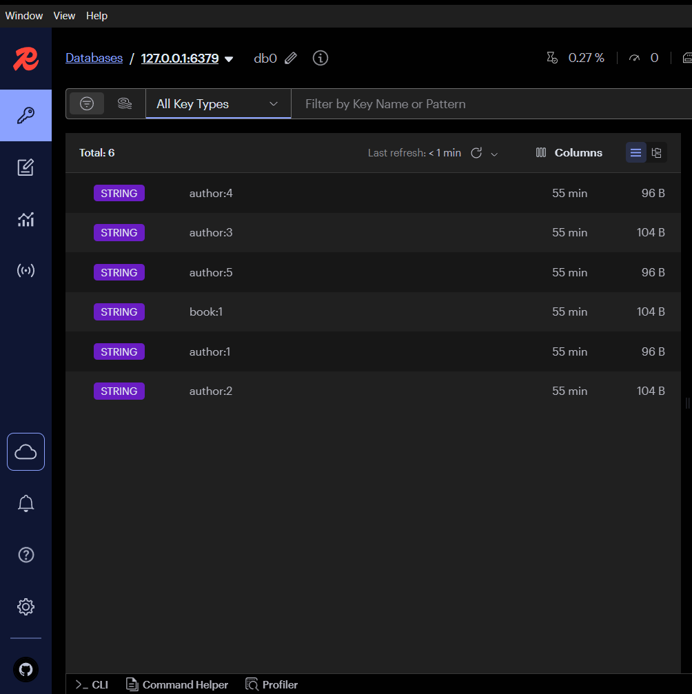

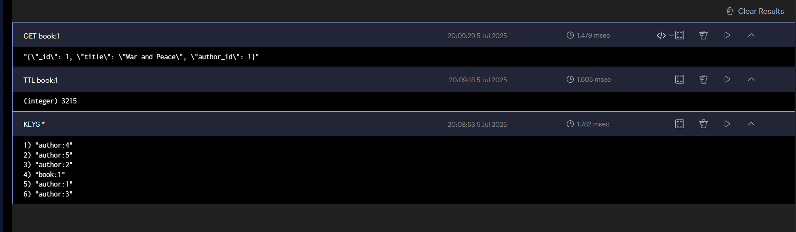

#### Kibana:

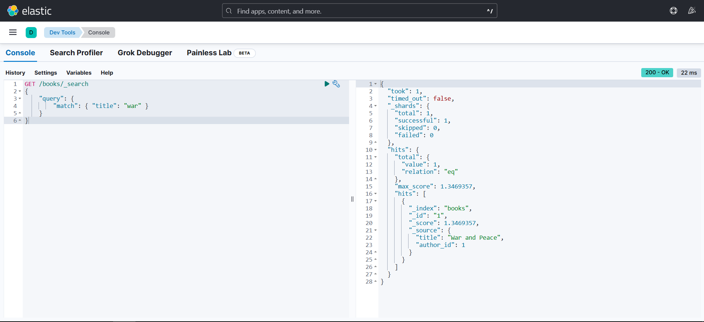

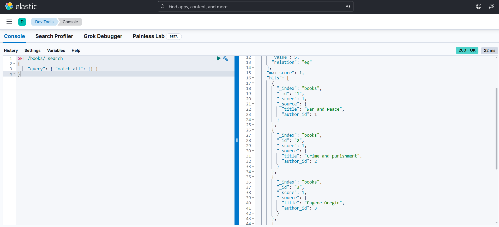

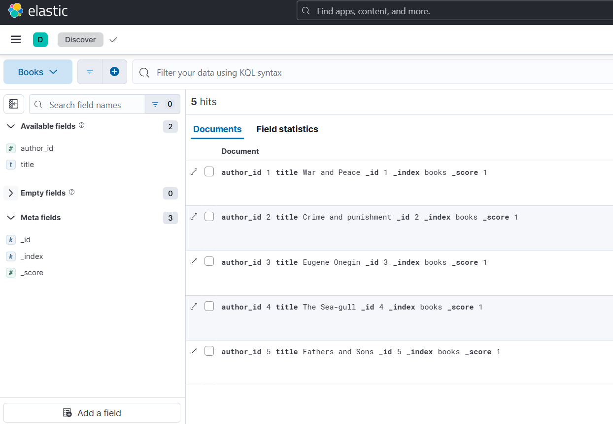

### Handle error :

```text
Error: [es/index] failed: [document_parsing_exception] 
[1:8] failed to parse field [_id] of type [_id] in 
document with id '1'. Preview of field's value: '1'
```

Error was because of wrong type field "_id" : 

First realization `indexDocument` method:

```java
import org.bson.Document;

public Result indexDocument(String index, String id, Document document) throws IOException {
   IndexRequest<Document> request = IndexRequest.of(b -> b
           .index(index)
           .id(id)
           .document(document)
   );

   IndexResponse response = client.index(request);
   return response.result();
}
```

Solution :

```java
import org.bson.Document;

public Result indexDocument(String index, String id, Document document) throws IOException {
   Map<String, Object> source = new HashMap<>();
   document.forEach((key, value) -> {
      if (!"_id".equals(key)) {
         source.put(key, value);
      }
   });

   IndexRequest<Map<String, Object>> request = IndexRequest.of(b -> b
           .index(index)
           .id(id)
           .document(source)
   );

   IndexResponse response = client.index(request);
   return response.result();
}
```

### App schema:

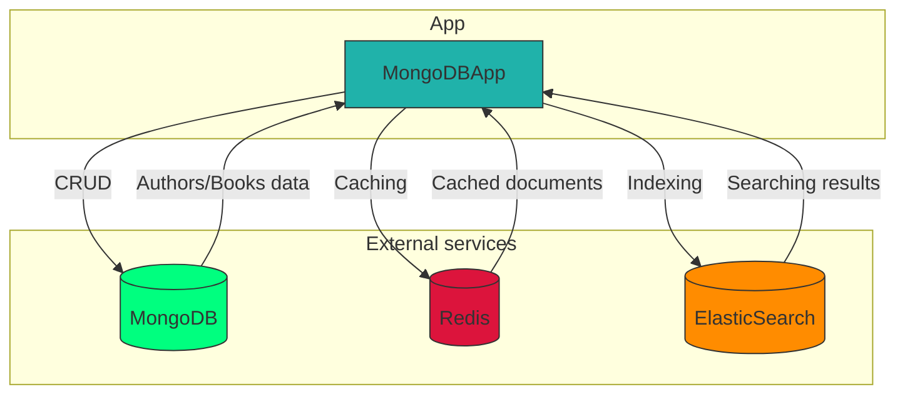

### Run project :

1) Execute the command in the root of the project: 

```bash
docker-compose up -d
```

2) Execute file `PostgresApp.java`

### Additional materials

* `JDBC` docs - https://docs.oracle.com/javase/tutorial/jdbc/basics/index.html
* `PreparedStatement` - https://docs.oracle.com/javase/tutorial/jdbc/basics/prepared.html
* `SQL`-injection - https://owasp.org/www-community/attacks/SQL_Injection
* `Redis for Java` - https://redis-docs.ru/develop/connect/clients/java/jedis/
* Indexing document in `ElasticSearch` - https://www.elastic.co/docs/reference/elasticsearch/clients/java/usage/indexing
* `Testcontainers` setup - https://testcontainers.com/guides/getting-started-with-testcontainers-for-java/

### Author - Maxim Kalugin